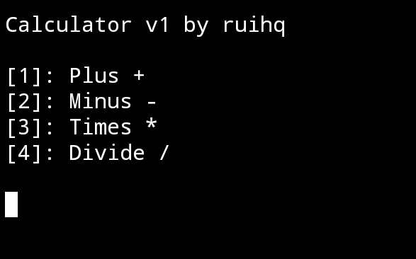
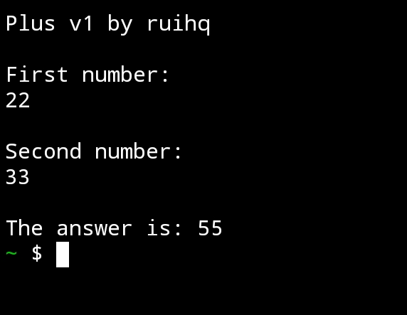

# Calculator:
Use an calculator for your Termux App, try Calculator now!




## Installation:
Firstly, install git using this command.

```pkg install git```

After installing git, clone this repository using this command.

```git clone https://github.com/ruihq/calcu```

Now after cloning it, install it using this command

```cd calcu; chmod +x install.sh; ./install.sh```

You finally installed it, use the command calcu to use it anytime.

```calcu```

# Author and Licenses
Uses MIT License.

Author ruihq